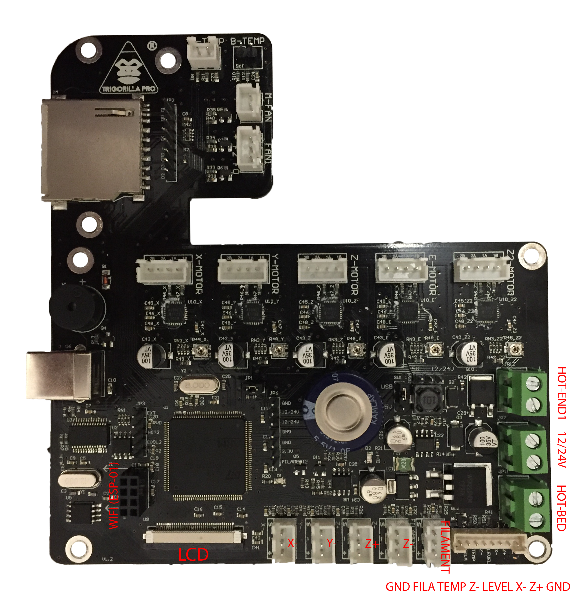

# Trigorilla Pro mainboard

- 32bit Cortex-M3 MCU (STM32F103ZET6)
- Soldered A4988 stepper drivers
- WIFI slot layout matches ESP-01 layout
- Manufactured by [cbd-3d](http://www.cbd-3d.com/en/prod/fdm.shtml)?
- [PL2303](http://www.prolific.com.tw/US/ShowProduct.aspx?p_id=225&pcid=41) USB to Serial (max baudrate seems to be 230400)
- 

# Pinout
- [Datasheet](https://www.st.com/resource/en/datasheet/cd00191185.pdf) (Page 27)
- PB0: Beeper
- PD3: LED
- PG4: Capacitor? (Power LED turns off slowly if pin is set HIGH)
- PA9: Serial USB Communication?

# Flashing bootloader
- Install [Arduino STM32](https://github.com/rogerclarkmelbourne/Arduino_STM32)
- Remove JP1 jumper and set SW1 jumper to USB mode
- Use stm32flash tool located in `Arduino_STM32/tools/..../stm32flash`
- `./stm32flash -b 230400 -w generic_boot20_pd3.bin -v -g 0x0 <port>`

# Stepper driver replacement
- [Trinamic Replacement Notes](https://www.trinamic.com/fileadmin/assets/Support/Appnotes/AN045-How_to_replace_Allegro_A4988_with_TMC2208_01.pdf) for replacing A4988 with TMC2208
- [Soldering Video](https://www.youtube.com/watch?v=ZgfgaxbQA6w)
- Replace C45 capacitor (100nF) with 0603 22nF 50V
- Replace R46 and R47 resistors (68mOhm) with 0603 150mOhm 0,5W

# Sources
- [ChiTu mainboard manual](http://www.chitucloud.com/chitudoc/read/compressed/ChiTu_FDM_manual%2FFDM_Chitu-V3.6-users-manual-%E8%8B%B1%E6%96%87%E8%AF%B4%E6%98%8E%E4%B9%A6.pdf)
- [Thingiverse hardware thread](https://www.thingiverse.com/groups/anycubic-i3-mega/forums/general/topic:26118)
